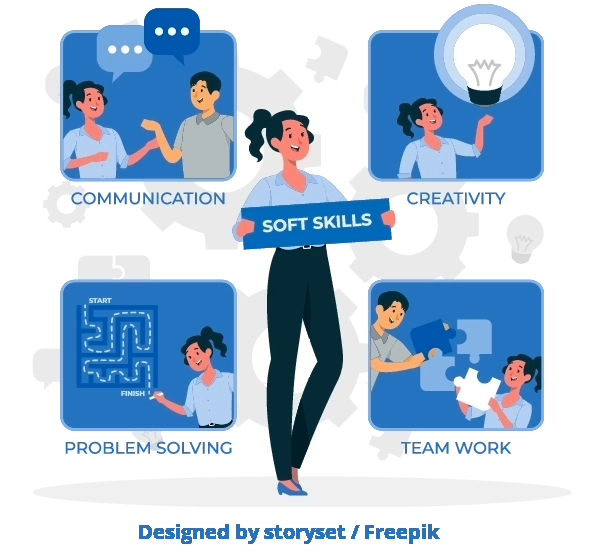

## Olá 👋, pessoa!

Meu nome Bruno Pessoa, sou um desenvolvedor web Full-Stack e me dedico a melhorar constantemente como profissional e como ser humano. Me formei em Engenharia Química, mas me apaixonei pela tecnologia e decidi segui-la como carreira. Trabalho com um elevado nível de responsabilidade e respeito, sempre em busca de melhorias contínuas.

###

<h5 align="center">Essas são algumas das competências das quais me orgulho</h5>

###

- Comunicação assertiva
- Solução de problemas
- Colaboração
- Empatia
- Autoliderança

###

### 🛠 Minhas Stacks

- 🌐 &nbsp; JavaScript | TypeScript | React | Redux | HTML | CSS 
- 💻 &nbsp; NodeJs | Jest | RTL | Docker | Linux
- 🛢 &nbsp; MySQL | Sqlite
- 🔧 &nbsp; Git | GitHub | VsCode
- ✨ &nbsp; Bootstrap
- 🗓 Possuo experiência com Kanban

### 🗃 Projetos de destaque

###

Veja meu __[portfólio](https://brunopessoa.tk)__ e saiba mais sobre mim e meus projetos.
### Vamos conversar!

 

__Email__: brunofernpessoa@gmail.com

